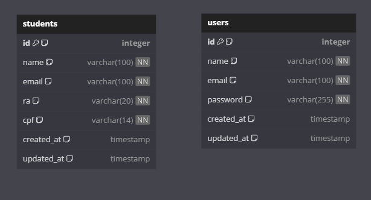

# COMMENTS.md - A+ Educação Challenge

## 1️⃣ Decisão de Arquitetura Utilizada

### Backend:
Adotei a **Clean Architecture**, separando a lógica de negócio da infraestrutura. Isso garante modularidade e facilita testes e futuras expansões.

- **API**: Camada de comunicação com o cliente, contendo os controladores e os endpoints.
- **Use Cases**: Contêm as regras de negócio da aplicação, como criação, listagem, atualização e remoção de alunos.
- **Infrastructure**: Responsável pelo acesso ao banco de dados (PostgreSQL via Sequelize).
- **Middlewares**: Middleware global de erro e middleware de async handler para evitar try/catch redundantes.

## Diagrama Banco de Dados
- Eu modelei duas tabelas, uma para representar os alunos matriculados e outra para representar os usuarios do sistema.

### Frontend:
Usei **Nuxt 3 + TypeScript + Vuetify**, mantendo componentes modulares e centralizando regras de validação para facilitar reutilização.

- **Componentização**: Separei componentes como `SidebarProfile.vue`, `StudentTable.vue`, entre outros.
- **Composables**: Criados para lidar com chamadas HTTP (`useStudentApi.ts`) e notificações (`useNotification.ts`).
- **SCSS**: Padronizei cores e estilos globais no `app.scss` e referenciei nos componentes com `@use`.
- **Validação**: Todas as regras de formulários foram centralizadas no `validationRules.ts`.

---

## 2️⃣ Bibliotecas Utilizadas

- **Backend**:
    - `express` (framework da API)
    - `sequelize` + `pg` (ORM e banco de dados PostgreSQL)
    - `jest` (testes unitários)
    - `jsonwebtoken` (para autenticação JWT)
    - `bcryptjs` (criptografia de senhas)
    - `dotenv` (variáveis de ambiente)

- **Frontend**:
    - `nuxt` (framework Vue.js)
    - `vuetify` (componentes de UI)
    - `vue-router` (navegação)
    - `pinia` (gerenciamento de estado)
    - `axios` (requisições HTTP)

---

## 3️⃣ Melhorias Futuras

Se houvesse mais tempo, eu:

- Melhoraria a **componentização** e otimização de código do front, criando componente padrao pra botões, inputs, etc.
- Criaria **sistema de telemetria e auditoria** usando os campos `created_at` e `updated_at` para logs.
- Criaria **filtros** e opções de ordenação mais robustas na listagem de alunos.
- Melhoraria a **documentação**, incluindo OpenAPI para a API.
- Adicionaria paginação e filtros na listagem de alunos, para melhorar a performance.
- Faria uma logica de "remember me" para o login.
- aplicado testes de integração no backend.
- aplicado testes no frontend.
---

## 4️⃣ Requisitos Entregues e Não Entregues

**Funcionalidades obrigatórias entregues**:
- CRUD completo de alunos
- Validação de campos
- Interface responsiva e estilizada
- Testes unitários no backend
- **Autenticação JWT básica implementada**

Melhorias para o futuro:

- **Autenticação com Google**
- **Testes no frontend**
- **Uso dos campos created_at e updated_at para auditoria**
- **Dashboard de métricas (telemetria)**

---

## 5️⃣ Instruções para rodar o projeto

Entrega feita com dedicação! 

