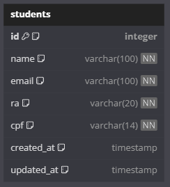

# Diário de Desenvolvimento - 10/02/2025
- Decisao da Arquitetura
- Decisao da Stack do Backend
- Modelagem do Banco de Dados

## Decisão de Arquitetura

Para o backend, foi decidido seguir a **Clean Architecture**. Essa escolha foi feita por priorizar a separação clara das responsabilidades em camadas, o que ajuda a manter o código mais organizado e fácil de escalar. Reconheço que esse padrão pode trazer uma leve complexidade adicional no início, mas acredito que o ganho em legibilidade e facilidade de manutenção compensa qualquer desafio inicial.

Segue o diagrama representando o fluxo da arquitetura do backend:

### Por que Clean Architecture?
1. Separação de responsabilidades, reduzindo o impacto de mudanças.
2. Melhor organização, facilitando a manutenção e a extensão do sistema.
3. Maior facilidade para testes unitários e de integração.
4. Possível escalabilidade da aplicação.

## Decisão da Stack do Backend

Depois de analisar os requisitos do projeto e considerando as tecnologias que tenho mais experiência e interesse em trabalhar, escolhi a seguinte stack para o backend:

- **Node.js, TypeScript, ,Sequelize, PostgreSQL, Jest**

## Modelagem do Banco de Dados

Outro passo importante foi criar a modelagem inicial do banco de dados. 
Para isso, usei o **DBDiagram.io** para representar visualmente as tabelas e seus relacionamentos. 
A estrutura inicial conta com duas tabelas principais:

- **students:** Para armazenar os dados dos alunos.
- **enrollments:** Para controlar as matrículas dos alunos em diferentes cursos.

Aqui está o diagrama do banco:

### Decisões importantes no banco de dados:
1. **Campos imutáveis:** `ra` e `cpf` são únicos.
2. **Rastreamento:** Campos como `created_at`, `updated_at` e `enrolled_at` para histórico.
3. **Relacionamento 1:N:** Um aluno pode ter várias matrículas, mas cada matrícula pertence a apenas um aluno.

---
